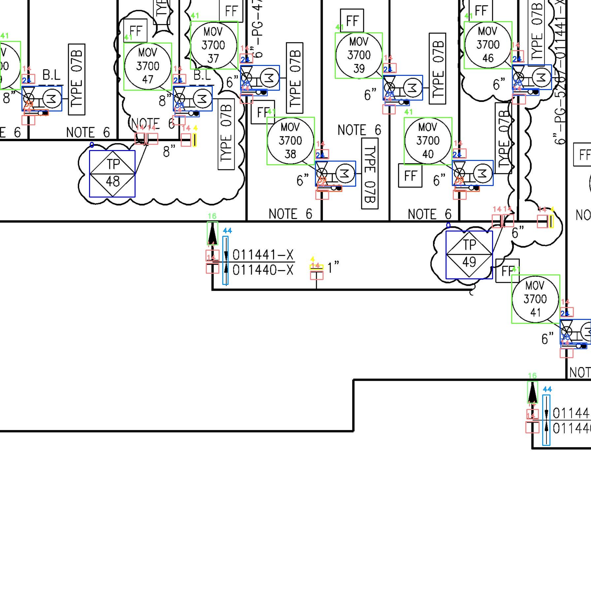
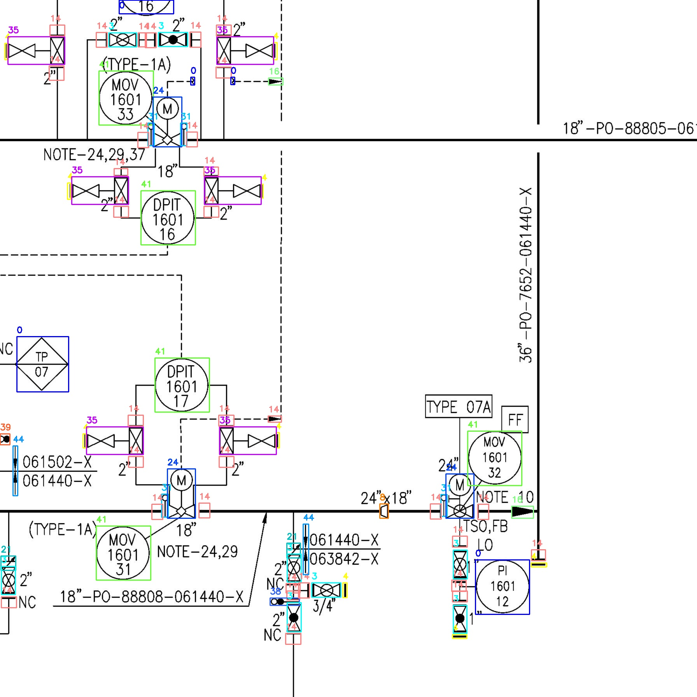
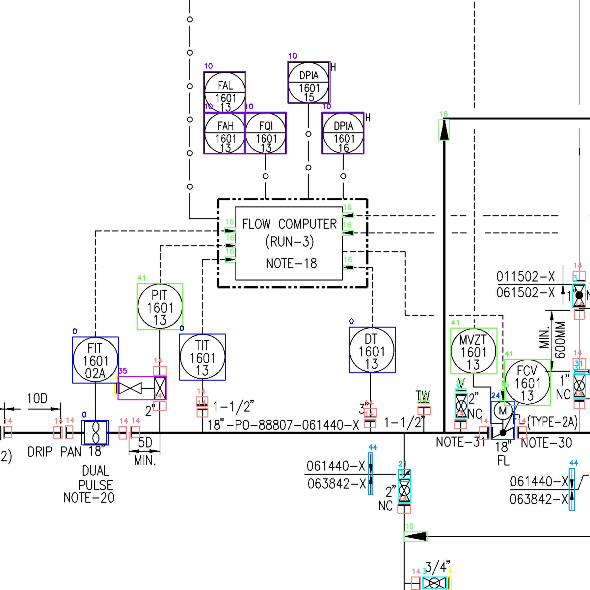
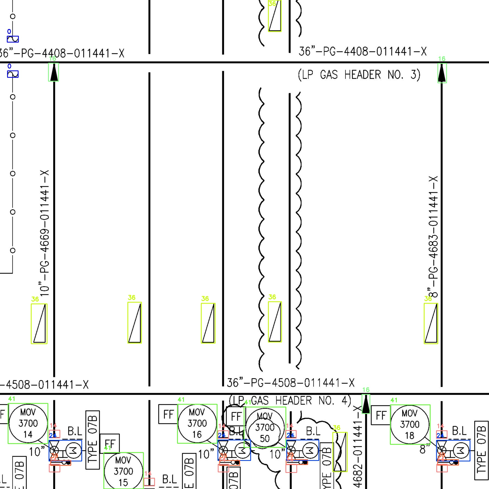

# Symbol_Detection_For_Large_Complex_Diagrams
Deep learning-based symbol detection pipeline with GELAN-E, data preprocessing, and production deployment for PNID.io.


# 🔍 Symbol Detection with GELAN-C for PNID.io  

🚀 This repository contains the complete pipeline for **Symbol Detection** developed for the Dubai-based startup [PNID.io](https://pnid.io).  
This project was built as a follow-up milestone after the OCR project, with challenges like symbol variations, GPU memory constraints, patch-based image processing, and seamless rejoining of results.  

---

## 📌 Project Highlights  
- ✅ Developed a **robust symbol detection pipeline** from **data preprocessing → annotation → training → deployment**.  
- ✅ Addressed challenges such as **different symbol styles across projects** and **patch-based image handling**.  
- ✅ Helped the labeling team by generating **75–80% annotated raw data** in Roboflow-compatible format.  
- ✅ Trained the **GELAN-C model** on **A4 GPUs for 12+ hours**, achieving highly accurate results.  
- ✅ The model is now **deployed in production** at [PNID.io](https://pnid.io).  
- ✅ Offered a **full-time position in Dubai** with complete relocation support due to the project’s professional impact.  

---

## 📂 Repository Structure  

This repo contains a single Jupyter Notebook which handles the **entire pipeline**:  


🔹 **Notebook Overview:**  
1. **Data Preprocessing** → Image splitting into optimal patches (GPU-friendly).  
2. **Annotation Support** → Auto-generation of Roboflow-compatible labels.  
3. **Training** → GELAN-C model training scripts and configs.  
4. **Inference** → Symbol detection and result visualization.  
5. **Deployment** → Exporting trained weights and preparing for production testing.  

---

## 🧠 Model & Weights  

Download the trained **GELAN-C model weights** here:  
👉 [Model Link](https://your-model-link-here.com)  

---

## 📸 Results  

Here are sample detection outputs from the trained model:  

  
*Example 1 – Symbols detected successfully*  

  
*Example 2 – Symbols detected successfully*  

  
*Example 3 – Symbols detected successfully* 

  
*Example 4 – Symbols detected successfully* 
---

## 🚀 Next Milestones  

🔜 Upcoming improvements to the pipeline:  
- 📏 **Line Detection**  
- 🏷️ **Symbol Classification**  

---

## ⚙️ Installation & Usage  

1. Clone this repo:  
   ```bash
   git clone https://github.com/yourusername/Symbol_Detection_For_Large_Complex_Diagrams.git
   cd Symbol_Detection_For_Large_Complex_Diagrams


